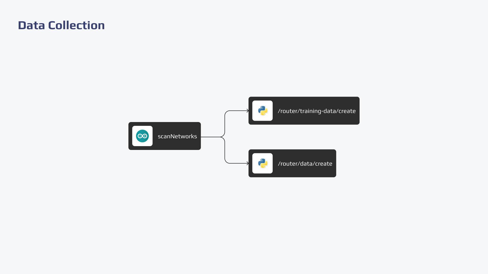

  

  
  </a>

## Descrição

Este código para o ESP32 conecta-se a uma rede Wi-Fi, escaneia as redes Wi-Fi próximas e envia as informações para a API via HTTPS. As informações enviadas incluem o ID do ESP e os detalhes das redes Wi-Fi encontradas (MAC, SSID e RSSI).

Para a configuração mais detalhada, consulte a [configuração do ESP32](https://github.com/IndoorTrackingTeam/indoor-tracking-data-collection/tree/main/esp32/configuration.md).

## Arquitetura

  

## Tecnologias
Essas tecnologias foram selecionadas para a aplicação com o objetivo de garantir alto desempenho,  eficiência e alta qualidade na aplicação.

